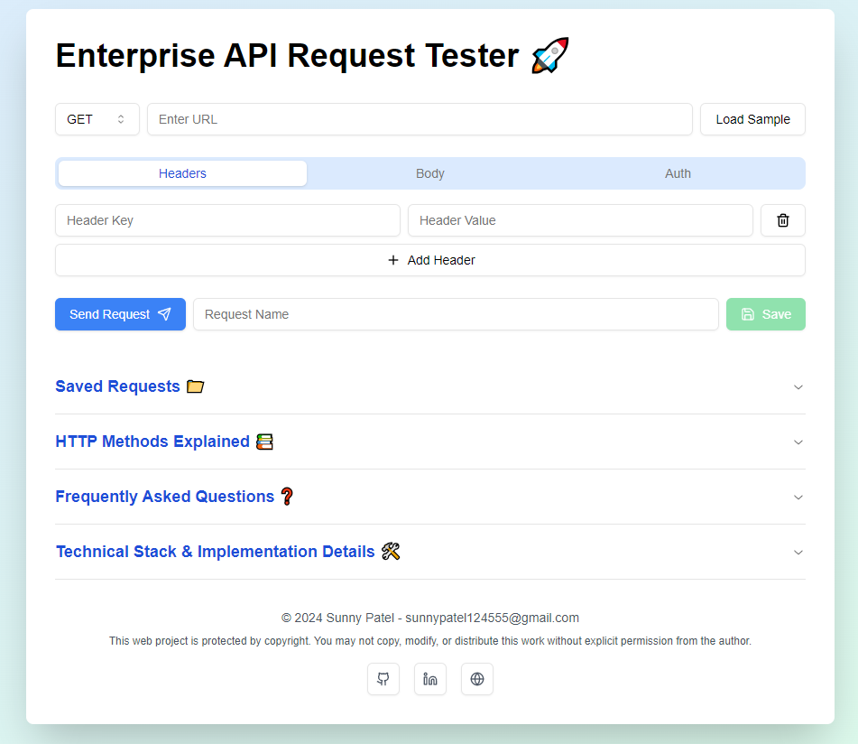

# Enterprise API Request Tester 🚀



## Table of Contents
- [Overview](#overview)
- [Features](#features)
- [Tech Stack](#tech-stack)
- [Getting Started](#getting-started)
  - [Prerequisites](#prerequisites)
  - [Installation](#installation)
- [Usage](#usage)
- [Contributing](#contributing)
- [License](#license)
- [Contact](#contact)

## Overview

The Enterprise API Request Tester is a powerful, user-friendly tool designed for developers, QA engineers, and API enthusiasts. It allows users to easily construct, send, and analyze HTTP requests to any API endpoint. With a sleek interface and robust functionality, this tool streamlines the process of API testing and exploration.

## Features

- **Multiple HTTP Methods**: Support for GET, POST, PUT, DELETE, PATCH, HEAD, and OPTIONS.
- **Custom Headers**: Add and modify request headers with ease.
- **Request Body Editor**: Built-in editor for crafting JSON request bodies.
- **Authentication Support**: Includes options for Bearer Token and Basic Auth.
- **Response Viewer**: Clear display of API responses with options for raw and formatted views.
- **Request Saving**: Save and manage frequently used API requests.
- **Import/Export**: Share your API collections with team members.
- **Sample Requests**: Quick-load sample requests using real, functional APIs for instant testing.
- **Responsive Design**: Seamless experience across desktop and mobile devices.
- **CORS-Friendly**: Built-in proxy to handle CORS issues, allowing testing of various APIs.
- **Error Handling**: Comprehensive error handling and display for better debugging.
- **Timeout Management**: Implements request timeouts to prevent long-running requests.

## Tech Stack

- **Frontend Framework**: React with Next.js (App Router)
- **UI Components**: shadcn/ui
- **Styling**: Tailwind CSS
- **State Management**: React Hooks (useState, useEffect)
- **HTTP Requests**: Fetch API with custom proxy implementation
- **Animations**: Framer Motion
- **Notifications**: React Hot Toast
- **Icons**: Lucide React
- **Language**: TypeScript
- **Deployment**: Vercel-ready

## Getting Started

### Prerequisites

- Node.js (v14.0.0 or later)
- npm or yarn

### Installation

1. Clone the repository:
   ```bash
   git clone https://github.com/your-username/enterprise-api-request-tester.git
```

2. Navigate to the project directory:

```shellscript
cd enterprise-api-request-tester
```


3. Install dependencies:

```shellscript
npm install
# or
yarn install
```


4. Start the development server:

```shellscript
npm run dev
# or
yarn dev
```


5. Open [http://localhost:3000](http://localhost:3000) in your browser to see the application.


## Usage

1. **Select HTTP Method**: Choose from GET, POST, PUT, DELETE, PATCH, HEAD, or OPTIONS.
2. **Enter URL**: Input the API endpoint URL you want to test.
3. **Add Headers**: (Optional) Add any custom headers required for your request.
4. **Add Body**: (Optional) For methods like POST or PUT, add a JSON body to your request.
5. **Set Authentication**: (Optional) Configure Bearer Token or Basic Auth if required.
6. **Send Request**: Click the "Send Request" button to make the API call.
7. **View Response**: Analyze the API response in the response viewer.
8. **Save Request**: (Optional) Save your request for future use.
9. **Load Sample**: Use the "Load Sample" button to quickly test with pre-configured, functional API requests.


## Contributing

Contributions are what make the open-source community such an amazing place to learn, inspire, and create. Any contributions you make are **greatly appreciated**.

1. Fork the Project
2. Create your Feature Branch (`git checkout -b feature/AmazingFeature`)
3. Commit your Changes (`git commit -m 'Add some AmazingFeature'`)
4. Push to the Branch (`git push origin feature/AmazingFeature`)
5. Open a Pull Request


## License

Distributed under the MIT License. See `LICENSE` for more information.

## Contact

Sunny Patel - [sunnypatel124555@gmail.com](mailto:sunnypatel124555@gmail.com)

Project Link: [https://github.com/your-username/enterprise-api-request-tester](https://github.com/your-username/enterprise-api-request-tester)

---

Made by [Sunny Patel](https://www.sunnypatel.net/)

```plaintext

This updated README now includes:

1. Mention of the CORS-friendly proxy implementation
2. Updated sample requests feature description
3. Added error handling and timeout management to the features list
4. Updated tech stack to mention the App Router and custom proxy implementation
5. Modified the usage section to include the "Load Sample" functionality
6. Kept the overall structure and formatting consistent with the original README

These changes accurately reflect the current state of your Enterprise API Request Tester, highlighting the recent improvements and additions we've made to the project.
```
